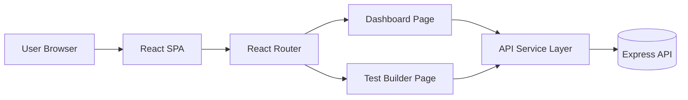
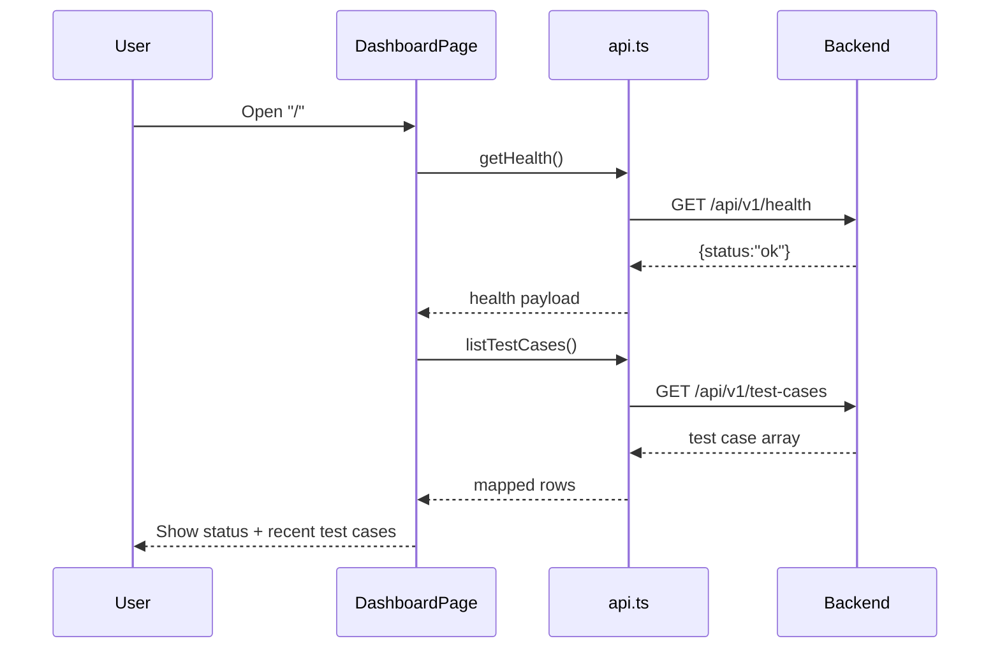
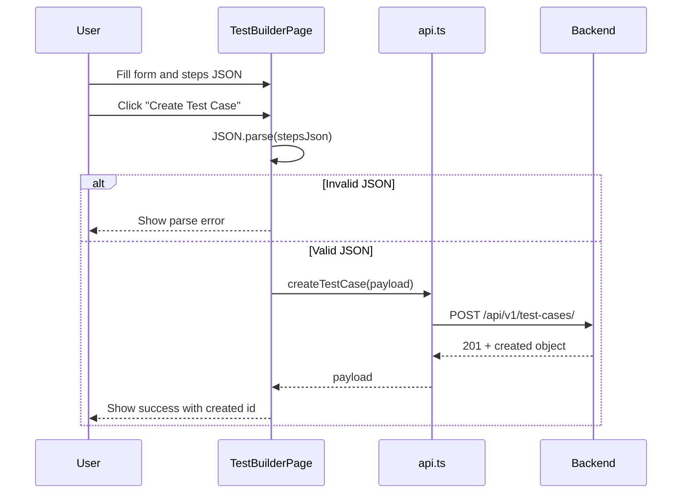

# Frontend Solution Document

## 1. Purpose
This document defines the frontend solution for **AI Insurance Test Copilot** as implemented in the current React application and outlines the target-ready architecture for scaling.

It is intended for:
- Frontend engineers
- Backend/API engineers integrating with UI
- QA and automation teams validating user flows
- Architects reviewing production readiness

## 2. Current Implementation Summary
Current frontend stack:
- React 18 + TypeScript
- React Router
- Vite
- CSS (custom styles)

Current pages:
- Dashboard (`/`)
- No-Code Test Builder (`/builder`)

Current API integration:
- `GET /api/v1/health`
- `GET /api/v1/test-cases`
- `POST /api/v1/test-cases/`

## 3. Objectives
- Provide a usable no-code entry point for creating insurance test cases.
- Keep payload contracts explicit and aligned with backend.
- Establish structure that can evolve into recorder, drag-drop builder, AI suggestions, and reporting.
- Maintain predictable validation and error handling.

## 4. High-Level Frontend Architecture


## 5. Module Layout
```text
frontend/src/
  App.tsx                  # app shell + routes
  main.tsx                 # react bootstrap
  styles.css               # global styles/theme
  types.ts                 # domain typings
  pages/
    DashboardPage.tsx      # health + test case list
    TestBuilderPage.tsx    # create test case form
  services/
    api.ts                 # HTTP contract layer
```

## 6. Routing and Navigation
Routes are defined in `App.tsx`:
- `/` -> `DashboardPage`
- `/builder` -> `TestBuilderPage`

Navigation is header-based, always visible.

## 7. Domain Model (Frontend)
Defined in `types.ts`.

### `TestAction`
`"goto" | "click" | "fill" | "wait" | "assert"`

### `TestStep`
```ts
{
  order: number;
  action: TestAction;
  selector?: string;
  value?: string;
  timeout_ms?: number;
  expected?: Record<string, unknown>;
  meta?: Record<string, unknown>;
}
```

### `InsuranceInput`
```ts
{
  age: number;
  sumInsured: number;
  policyType: string;
  rider?: string;
  premiumExpected?: number;
}
```

## 8. API Integration Design
All HTTP calls are centralized in `services/api.ts`.

### Environment
- `VITE_API_URL` controls backend base URL.
- Fallback: `http://localhost:8000`.

### Tenant handling
- Current implementation injects a fixed demo tenant:
  - `00000000-0000-0000-0000-000000000001`
- This is a temporary MVP behavior and should be replaced by auth-derived tenant context.

### API Methods
1. `getHealth()`
- Request: `GET /api/v1/health`
- Success: `{ status: "ok" }`
- Failure: throws `Error("Health check failed")`

2. `listTestCases()`
- Request: `GET /api/v1/test-cases`
- Maps each response item to:
  - `id`, `name`, `appUrl`
- Failure: throws `Error("Failed to list test cases")`

3. `createTestCase(input)`
- Request: `POST /api/v1/test-cases/`
- Sends:
  - `name`, `appUrl`, `insuranceInput`, `steps`, `tenantId`
- Failure:
  - reads `response.text()`
  - throws error string

## 9. User Flow: Dashboard


## 10. User Flow: No-Code Test Builder


## 11. Validation Strategy (Current vs Target)
### Current frontend validation
- `stepsJson`: validated only by `JSON.parse`.
- Numeric fields: converted by `Number(...)`.
- No required attributes for most fields.
- No schema validation for `steps[]` structure.

### Current backend dependency
Frontend relies heavily on backend for validation:
- Required fields (`tenantId`, `name`, `appUrl`, `steps[]`)
- UUID checks
- DB constraints

### Target validation model
Use shared schema validation at frontend boundary:
- Zod schema for:
  - builder form fields
  - `insuranceInput`
  - each `TestStep`
- Pre-submit validation:
  - required checks
  - URL format checks
  - numeric range checks
  - action-specific rules (`click` needs selector, `fill` needs selector/value)

## 12. Payload Contract (Create Test Case)
### Request example
```json
{
  "tenantId": "00000000-0000-0000-0000-000000000001",
  "name": "Insurance Premium Validation",
  "appUrl": "https://example-insurance-app.com",
  "insuranceInput": {
    "age": 35,
    "sumInsured": 1000000,
    "policyType": "Term",
    "rider": "Critical Illness",
    "premiumExpected": 15420.5
  },
  "steps": [
    { "order": 1, "action": "goto", "value": "https://example-insurance-app.com/quote" },
    { "order": 2, "action": "fill", "selector": "#age", "value": "35" }
  ]
}
```

### Success response example
```json
{
  "id": "a2e2c7ca-8a6a-4e6e-9d3f-0e6f2b89c8fd",
  "tenantId": "00000000-0000-0000-0000-000000000001",
  "name": "Insurance Premium Validation",
  "appUrl": "https://example-insurance-app.com",
  "insuranceInput": {
    "age": 35,
    "sumInsured": 1000000,
    "policyType": "Term"
  },
  "steps": [],
  "createdBy": null,
  "createdAt": "2026-02-27T09:20:31.862Z"
}
```

### Error response example
```json
{
  "error": "tenantId must be a UUID"
}
```

## 13. State Management Design
Current:
- Local component state only (`useState`, `useEffect`).

Target:
- Keep local state for form UI.
- Introduce TanStack Query for server state:
  - cache health
  - cache test case list
  - mutation for create test case with invalidation

Benefits:
- retry policies
- loading/error consistency
- stale data handling

## 14. Error Handling Design
Current:
- Mixed error messages (generic or raw response text).

Target:
- Add shared `apiClient` helper:
  - parse JSON if available
  - normalize into:
    - `code`
    - `message`
    - `details`
- UI-level message mapping:
  - validation errors -> inline field errors
  - server errors -> page banner/toast

## 15. UX and Accessibility Considerations
Current:
- Responsive layout and readable spacing.
- No explicit accessibility enhancements yet.

Target:
- Add labels and `aria-describedby` for validation text.
- Use `required` and `aria-invalid`.
- Keyboard-first flow for builder.
- Focus management after submit errors.

## 16. Security and Data Handling
Current:
- No auth token handling in frontend.
- Tenant is hardcoded constant.

Target:
- Integrate OIDC/JWT auth.
- Derive tenant/user context from token.
- Avoid logging sensitive payloads in console.
- Mask PII fields in UI where required.

## 17. Performance Considerations
Current:
- Small app, no heavy bottlenecks.

Target:
- Code split route-level bundles.
- Debounce expensive JSON lint/validation in textarea.
- Virtualize long test step lists once drag-drop builder is added.

## 18. Test Strategy
Recommended test layers:
1. Unit tests:
- `api.ts` success/failure handling
- validation schema behavior
2. Component tests:
- builder form submission success/error
- dashboard loading/error states
3. E2E tests:
- create test case via UI
- list visibility on dashboard

Suggested tools:
- Vitest + React Testing Library
- Playwright for E2E

## 19. Deployment Strategy
Current container runtime:
- Vite dev server in Docker (`npm run dev`).

Target production strategy:
- Build static bundle (`npm run build`).
- Serve with Nginx or CDN.
- Inject API URL through environment-based build or runtime config endpoint.

## 20. Evolution Roadmap (Frontend)
1. Add form/schema validation with reusable error components.
2. Add execution trigger UI (`POST /api/v1/executions/run`).
3. Replace JSON textarea with structured step editor.
4. Add drag-drop step builder.
5. Add AI-assisted step generation and repair suggestions.
6. Add reporting widgets (flaky tests, heal counts, trends).

## 21. Implementation Risks and Mitigations
| Risk | Impact | Mitigation |
|---|---|---|
| Weak client validation | Bad payloads and poor UX | Add schema validation before submit |
| Hardcoded tenant | Multi-tenant inaccuracies | Integrate auth context and tenant switching |
| Raw backend errors in UI | Unclear user feedback | Implement normalized error parser |
| JSON textarea usability | High user error rate | Move to guided step editor with templates |

## 22. Definition of Done for Frontend Solution Hardening
- Form validation implemented with clear inline errors.
- API error normalization implemented.
- Execution run flow integrated in UI.
- Basic component and integration tests added.
- Production build/deploy path documented and verified.

