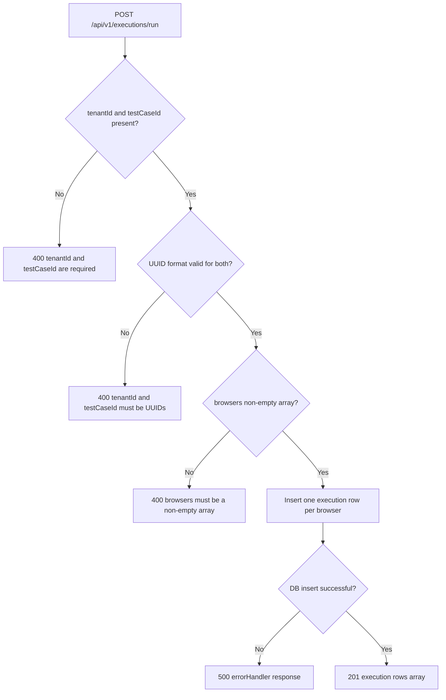

# Validation Matrix (Frontend vs Backend)

This document provides a field-by-field validation mapping for the current implementation.

## Source of Truth
- Frontend:
  - `frontend/src/pages/TestBuilderPage.tsx`
  - `frontend/src/services/api.ts`
  - `frontend/src/types.ts`
- Backend:
  - `backend/src/app.js`
  - `backend/src/routes/health.js`
  - `backend/src/routes/testCases.js`
  - `backend/src/routes/executions.js`
  - `backend/migrations/001_initial.sql`

## End-to-End Request Validation Flow
```mermaid
flowchart LR
    U[User submits Test Builder form] --> P[Parse stepsJson via JSON.parse]
    P -->|Invalid JSON| F1[Frontend error shown]
    P -->|Valid JSON| C[POST /api/v1/test-cases]

    C --> R1{Required fields present? tenantId, name, appUrl, steps[]}
    R1 -->|No| B400A[400 required fields error]
    R1 -->|Yes| R2{tenantId UUID valid?}
    R2 -->|No| B400B[400 tenantId UUID error]
    R2 -->|Yes| DB[(Insert test_cases row)]

    DB --> R3{DB constraints pass? FK/NOT NULL/JSONB}
    R3 -->|No| B500[500 errorHandler response]
    R3 -->|Yes| OK[201 created response]
    OK --> UI[Frontend success state]
```

## Backend Decision Flowchart: Create Test Case
```mermaid
flowchart TD
    A[POST /api/v1/test-cases/] --> B{tenantId, name, appUrl, steps present?}
    B -->|No| E1[Return 400: tenantId, name, appUrl, and steps[] are required]
    B -->|Yes| C{Array.isArray(steps)?}
    C -->|No| E1
    C -->|Yes| D{isUuid(tenantId)?}
    D -->|No| E2[Return 400: tenantId must be a UUID]
    D -->|Yes| E[INSERT into test_cases]
    E --> F{SQL success?}
    F -->|No| E3[Return 500 via errorHandler]
    F -->|Yes| G[Return 201 with mapped payload]
```

## Matrix A: Frontend Field-Level Validation
| Field | Frontend Type | Frontend Validation | Required in UI | Notes |
|---|---|---|---|---|
| `name` | string | No explicit validation | No explicit `required` | Empty string can be sent |
| `appUrl` | string | No URL format validation | No explicit `required` | Any string accepted client-side |
| `age` | number | `Number(...)` conversion | No explicit `required` | `NaN` can be produced |
| `sumInsured` | number | `Number(...)` conversion | No explicit `required` | `NaN` can be produced |
| `policyType` | string | No validation | No explicit `required` | Any string accepted |
| `rider` | string (optional) | No validation | Optional | Pass-through field |
| `premiumExpected` | number (optional) | `Number(...)` conversion | Optional | `NaN` can be produced |
| `stepsJson` | string | `JSON.parse(...)` | Required for submit success | Parse failure shows UI error |
| `steps` | array | No schema validation per step | Required by backend | Any array shape accepted |
| `tenantId` | UUID string | Hardcoded in `api.ts` | Always included | Uses demo tenant constant |

## Matrix B: Backend API Validation by Endpoint
| Endpoint | Field | Required | Validation Rule | Failure Status | Failure Response |
|---|---|---|---|---|---|
| `POST /api/v1/test-cases/` | `tenantId` | Yes | UUID format via `isUuid` | 400 | `{ "error": "tenantId must be a UUID" }` |
| `POST /api/v1/test-cases/` | `name` | Yes | Presence check (`!name`) | 400 | `{ "error": "tenantId, name, appUrl, and steps[] are required" }` |
| `POST /api/v1/test-cases/` | `appUrl` | Yes | Presence check (`!appUrl`) | 400 | `{ "error": "tenantId, name, appUrl, and steps[] are required" }` |
| `POST /api/v1/test-cases/` | `steps` | Yes | `Array.isArray(steps)` | 400 | `{ "error": "tenantId, name, appUrl, and steps[] are required" }` |
| `POST /api/v1/test-cases/` | `insuranceInput` | No | No route-level schema validation | N/A | Stored as JSONB/null |
| `POST /api/v1/test-cases/` | `createdBy` | No | No UUID check in route | 500 possible | DB FK/type errors bubble to error handler |
| `GET /api/v1/test-cases/:testCaseId` | `testCaseId` (path) | Yes | UUID format via `isUuid` | 400 | `{ "error": "testCaseId must be a UUID" }` |
| `GET /api/v1/test-cases/:testCaseId` | Row existence | Yes | `rowCount === 0` | 404 | `{ "error": "Test case not found" }` |
| `POST /api/v1/executions/run` | `tenantId` | Yes | Presence + UUID format | 400 | `{ "error": "tenantId and testCaseId must be UUIDs" }` |
| `POST /api/v1/executions/run` | `testCaseId` | Yes | Presence + UUID format | 400 | `{ "error": "tenantId and testCaseId must be UUIDs" }` |
| `POST /api/v1/executions/run` | `browsers` | No (defaults provided) | Must be non-empty array | 400 | `{ "error": "browsers must be a non-empty array" }` |
| `POST /api/v1/executions/run` | Browser values | N/A | No enum restriction | N/A | Non-standard browser strings can be stored |

## Matrix C: Database Constraint Validation
| Column | Constraint | Enforcement Layer | API Impact |
|---|---|---|---|
| `test_cases.tenant_id` | FK `tenants(id)` | PostgreSQL | Unknown tenant -> 500 error |
| `test_cases.name` | `NOT NULL` | PostgreSQL | Null insert -> 500 error |
| `test_cases.app_url` | `NOT NULL` | PostgreSQL | Null insert -> 500 error |
| `test_cases.steps` | `JSONB NOT NULL` | PostgreSQL | Null/invalid cast -> 500 error |
| `test_cases.created_by` | FK `users(id)` (nullable) | PostgreSQL | Invalid non-null user -> 500 error |
| `executions.tenant_id` | FK `tenants(id)` | PostgreSQL | Unknown tenant -> 500 error |
| `executions.test_case_id` | FK `test_cases(id)` | PostgreSQL | Unknown testCase -> 500 error |
| `executions.browser` | `NOT NULL` | PostgreSQL | Null browser -> 500 error |
| `executions.status` | `NOT NULL` | PostgreSQL | Null status -> 500 error |

## Response Contract Validation
| Layer | Behavior |
|---|---|
| Backend success mapping | DB snake_case mapped to camelCase in route mappers |
| Backend error format | Global middleware returns `{ "error": "<message>" }` |
| Frontend `getHealth/listTestCases` | Checks `response.ok`, throws fixed errors |
| Frontend `createTestCase` error parsing | Uses `response.text()`, may show raw JSON string instead of parsed `error` |

## Execution Run Validation Flowchart


